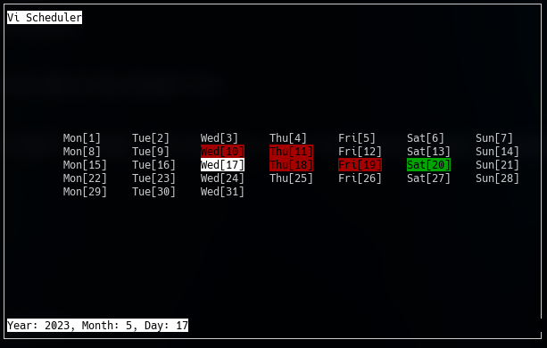

# Vi Scheduler

Vi Scheduler (VIS) is a lightweight tool that brings a Vim-like calendar to your terminal. It allows you to quickly view and edit your schedule, appointments, and tasks without leaving your command-line interface. 

Built using C++ and the Ncurses library, vis offers a fast and efficient way to manage your time in the terminal. It suppors various navigation and editing commands inspired by Vim, such as navigating between days or months, adding and deleting events.

# Dependencies 

The following is a list of dependencies that your system needs in order to be able to run vis. 
 - [The Ncurses library](https://invisible-island.net/ncurses/announce.html)
 - [Moreutils](https://joeyh.name/code/moreutils/)

# Building & Installation

To build vis, simply clone this repository and run `mkdir build; cd build; cmake ..; make`

Resulting binary will be generated inside the `/build/src/` folder called.

For installation, you can run `sudo make install` (from the /build directory)

# Usage

To start vis simply run the `vis` binary in your terminal alongside the name of the calendar file.

For example: `vis school.cal`

This will open the default view mode (month) and display the current month's calendar. From there, you can use the following commands to navigate and edit the calendar: 
 - `h/j/k/l` - Move 1 day left/down/up/right
 - `u/o` - Move 1 month left/right
 - `g` - Go to the beginning of the month
 - `G` - Go to the end of the month
 - `i` - Enter insert mode for selected day.
 - `x` - Delete event from selected day.
 - `w` - Write changes to file (i.e. save)
 - `q` - Quit and save the calendar

# Todos 

The following is a list of things that have been/still have to be completed.

 - ~~Basic prototype with vipe (in memory only)~~
  - ~~Finish all the basic shortcuts~~
 - ~~Ability to write a calendar to a file~~
 - ~~Ability to read a calendar from a file~~
 - Alerting function for errors and issues 
 - Logging / Debug flag 
 - Read input from stdin 

# Contributions 

Contributions and feedback are welcome! If you have any ideas or suggestions for improving vis, please submit a pull request or open an issue on Github. Let's make the FOSS community better, together!

# License 

This project is licensed under the GNU General Public License v3.0. See the `LICENSE` file for more information.
